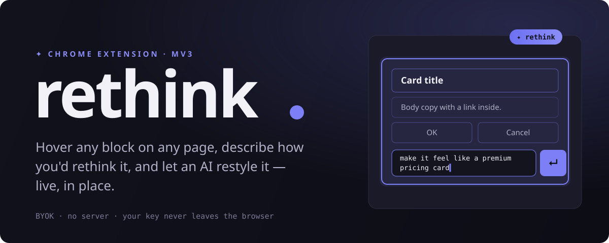

<div align="center">



<br />

**Hover any block on any page, describe how you'd rethink it, and let an AI restyle it — live, in place.**

[](manifest.json)
[](https://openrouter.ai/keys)


[](https://github.com/juanpe500/ai_model_selector)

</div>

---

**rethink** turns any web page into a canvas. Arm it, and the page becomes a DevTools-style
inspector: every block you hover outlines itself — softer the deeper it nests. Click one, tell
the AI what you want ("make this feel premium", "tighten the spacing", "dark, editorial"), and
it rewrites that block in place. Your OpenRouter key stays in your browser; there is no backend.

## ✦ Highlights

- **Inspector-grade hover** — nested outlines that fade with depth, and a floating `✦ rethink` tag.
- **A side panel where you point** — click a block and a docked panel opens beside it: prompt input
  plus **HTML / CSS / JS / Prompt** tabs.
- **Live streaming** — the model streams token-by-token; the **HTML tab shows a red/green diff** vs
  the original as it arrives, and **new CSS is injected live** so the page restyles before your eyes.
- **See the real prompt** — the **Prompt tab** shows the exact system + user message being sent,
  with your own instruction highlighted where it's injected.
- **Cost & tokens, tracked** — every result shows its cost and input/output tokens; a **Usage** tab
  keeps the last 10, and a full **paginated usage log** records model · cost · tokens · date · site ·
  mode (metadata only — never your prompt or the page).
- **Three enforced contracts** — from "classes only" to "change anything", with real guardrails (below).
- **Listeners survive** — in restructure mode, elements the AI keeps by `id` are grafted back as the
  *original live nodes*, so their event handlers come along for the ride.
- **Any model** — the whole OpenRouter catalogue via [`ai_model_selector`](https://github.com/juanpe500/ai_model_selector).
- **Zero server, zero build** — load the folder, paste a key, go.

## 🚀 Quick start

```text
1.  chrome://extensions  →  enable Developer mode  →  Load unpacked  →  pick this folder
2.  Click the ✦ icon  →  Settings  →  paste your OpenRouter key  →  Save
3.  Choose model…  →  pick anything from OpenRouter's catalogue
```

Get a key at **[openrouter.ai/keys](https://openrouter.ai/keys)**.

## 🎛️ Using it

| Step | What happens |
|------|--------------|
| **Activate** | Popup → *Activate rethink mode*. The cursor becomes a crosshair. |
| **Hover** | Every block outlines, softer the deeper it nests; a `✦ rethink` pill floats at its top-right. |
| **Click** | The block locks and a **side panel** docks beside it — prompt input + HTML/CSS/JS/Prompt tabs. |
| **Enter** | The block's HTML + matching CSS stream to your model; the **diff fills in live**, CSS applies live. |
| **After** | The HTML lands on the page with a flash. `again` · `undo` · `done`. <kbd>Esc</kbd> exits. |

## 🔒 Three modes, three contracts

The mode isn't just a hint to the model — the extension **enforces** it while applying the reply.

### `everything` — restyle everything
Rename/add classes, introduce tags, restructure freely.
- ✅ Every `id`, `data-*`, `name`, `value`, `href`, `src`, `alt`, `type`, `for` is **preserved**.
- ✅ Elements kept by `id` are grafted back as the **original live nodes** → **listeners survive**.
- ✅ Any `id` the model drops is stashed in a **hidden vault** so no data is lost.

### `classes` — restyle classes
Only `class` and inline `style` may change.
- ✅ Live and returned trees are walked in **lockstep**; only class/style is copied.
- ⊘ New nodes, tag renames, reordering, id edits are **silently discarded**.
- ✅ Live nodes are never replaced — every listener stays intact.

### `freedom` — full freedom
Anything, as long as it's valid, script-free HTML. One-click `undo` always restores the original.

> `<script>` tags are stripped by the prompt contract, and returned markup is **never executed as script**.

## 🧩 How it's wired

```text
manifest.json          MV3 · content script on <all_urls> · popup · options
background.js           service worker — settings, the streaming OpenRouter call, the
                        model list, the prompt preview (BYOK key lives here, never in a page)
content/content.js      nested-outline highlight · side panel with HTML/CSS/JS/Prompt tabs ·
                        live diff · CSS harvest · the three mode-enforcing DOM appliers
content/content.css     arms the crosshair + the apply flash; all UI lives in a Shadow DOM
popup/                  Main (activate · mode · model) · Usage (last 10 + total) · Settings (key)
options/                full-page config; hosts the ai_model_selector modal
usage/                  full paginated usage log (metadata only, no prompts/responses)
vendor/                 juanpe500/ai_model_selector, vendored (MIT — MV3 CSP blocks CDN)
icons/                  ✦ mark, generated
```

**Flow:** popup arms the tab → the content script highlights & harvests → opens a `Port` and
streams `{ prompt, html, css, mode }` to the worker → the worker calls OpenRouter with
`stream: true` and forwards each delta back over the Port → the content script parses the fenced
`html`/`css`/`js` blocks live (diff + live CSS) and, on completion, applies the HTML under the
mode's rules. The **Prompt tab** is fed by a separate `OR_PREVIEW` message so what you see is
exactly what's sent.

## 🤖 Model selection

The model picker is **[juanpe500/ai_model_selector](https://github.com/juanpe500/ai_model_selector)**,
vendored locally. The options page fetches OpenRouter's public `/models` catalogue through the
service worker into `window.OPENROUTER_MODELS` and opens `ModelSelectorModal`. Your choice is
stored in `chrome.storage.local` as `rethink_model`.

## 🔐 Privacy

- **BYOK, no server.** Requests go straight from the extension to OpenRouter.
- The key lives in `chrome.storage.local` and is only ever read inside the service worker —
  never injected into any page's JavaScript world.
- Only the block you select (its HTML + matching CSS) is sent, and only when you press Enter.

## ⚠️ Known edges

- Runs in the **top frame only** — cross-origin iframes aren't reached.
- Cross-origin stylesheets **can't be read** for the CSS harvest (browser security) and are skipped.
- Can't run on `chrome://`, the Web Store, or other privileged pages.
- Listener re-hooking covers elements kept by `id`; handlers on intermediate nodes the AI
  restructures away are lost by design.

## 📄 License

MIT. Bundles [`ai_model_selector`](https://github.com/juanpe500/ai_model_selector) (MIT).
